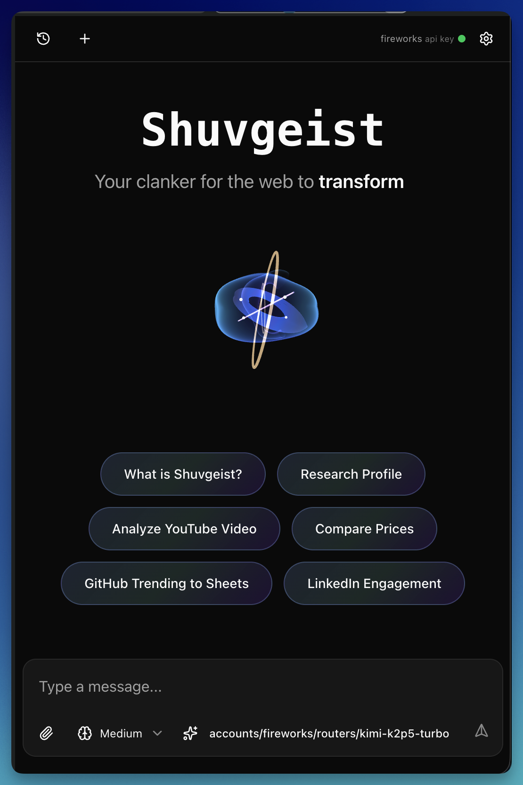

# Shuvgeist


Shuvgeist is a Chrome/Edge sidepanel extension for browser-native AI assistance and browser automation. It gives an LLM a controlled toolset for navigating pages, running page-context JavaScript, extracting structured data, working with attachments and artifacts, and reusing domain-specific skills you teach it over time.

This repo also ships:

- the `shuvgeist` CLI bridge for terminal-driven browser control
- a self-hostable CORS proxy for browser-restricted provider flows
- the static marketing/install site at `site/`

Works on Chrome 141+ and equivalent Edge builds.

## Screenshots

### Extension sidebar



### CLI bridge


## What ships today

### Extension

The extension lives in the browser sidepanel and persists its data locally in IndexedDB. Current user-facing capabilities include:

- chat sessions with resumable history and renameable titles
- file attachments and artifact generation
- page navigation and tab management
- REPL execution in an extension sandbox with page-context `browserjs()` access
- domain skills that inject reusable site-specific helpers into page scripts
- interactive element disambiguation when DOM targeting is unclear
- image extraction and document extraction tools
- Kokoro-first text-to-speech with page-bound read-along highlighting and audio-only cloud fallback paths
- optional debugger-backed tooling for stubborn sites that reject synthetic DOM events
- daily cost tracking with provider/model breakdowns
- settings tabs for subscriptions, providers/models, skills, bridge state, costs, and about/theme

### Provider and model support

Shuvgeist supports two main auth/config paths:

- Subscription login inside the extension:
  - Anthropic (Claude Pro/Max)
  - ChatGPT Plus/Pro via OpenAI Codex OAuth
  - GitHub Copilot
  - Google Gemini
- API key and custom-provider setup through the Providers & Models UI

The repo also includes:

- built-in MiniMax extension model registrations
- custom provider import/export
- `provider-presets/proxx.json` for the local `proxx` gateway workflow

### Skills

Skills are stored locally and matched by domain glob. The extension ships with a default skill library and a full skill manager UI:

- search/filter skills
- edit descriptions, examples, and injected library code
- import/export skill packs
- auto-inject matching skill libraries into `browserjs()` execution

An external coding-agent skill for driving the CLI bridge is included at `skills/shuvgeist/`.

### CLI bridge

The CLI bridge exposes the browser to terminal tools, scripts, and coding agents. The bridge server is a WebSocket relay between the CLI and the extension background worker.

Current CLI surface:

- browser lifecycle: `launch`, `close`, `status`
- navigation: `navigate`, `tabs`, `switch`
- page execution: `repl`, `eval`, `screenshot`, `cookies`, `select`
- deterministic workflows: `workflow run`, `workflow validate`
- semantic page inspection: `snapshot`, `locate`, `ref`, `frame`
- debugger-backed diagnostics: `network`, `device`, `perf`
- video repro capture: `record start`, `record stop`, `record status` using CDP screencast plus CLI-side ffmpeg encoding
- session control: `session`, `inject`, `new-session`, `set-model`, `artifacts`

Run `shuvgeist --help` for the full command reference.

### Supporting subprojects

- `proxy/`: minimal self-hosted CORS proxy with host allowlisting and filtered headers
- `site/`: static landing page and install guide

## Architecture

High-level flow:

`Chrome/Edge sidepanel UI -> Agent/tool runtime -> Background service worker -> Active tab(s)`

CLI flow:

`shuvgeist CLI -> Bridge server -> Extension background worker -> tab/session tools`

Important entry points:

- `src/sidepanel.ts`: main UI, agent wiring, tool registration, session handling
- `src/background.ts`: bridge ownership, offscreen execution fallback, session routing
- `src/bridge/`: CLI, protocol, server, session bridge, workflow support
- `src/tools/`: navigation, REPL, skills, snapshots, network capture, perf tools, debugger helpers
- `src/dialogs/`: settings tabs and first-run dialogs
- `src/storage/`: IndexedDB-backed sessions, skills, providers, and cost tracking

See [ARCHITECTURE.md](ARCHITECTURE.md) for a deeper code-oriented walkthrough. For the local-first TTS overlay and Kokoro read-along flow, see [docs/tts.md](docs/tts.md).

## Install

### Install from a release

1. Download the latest release from [GitHub Releases](https://github.com/shuv1337/shuvgeist/releases/latest).
2. Unzip it somewhere stable.
3. Open `chrome://extensions/` or `edge://extensions/`.
4. Enable Developer mode.
5. Click `Load unpacked` and select the extension directory.
6. In the extension details, enable:
   - `Allow user scripts`
   - `Allow access to file URLs`
7. Set site access to `On all sites`.

Open the sidepanel with:

- macOS: `Command+Shift+S`
- Windows/Linux: `Ctrl+Shift+S`

On first launch, connect at least one provider.

### Build from source

This repo expects sibling checkouts for linked packages:

```text
parent/
  mini-lit/
  pi-mono/
  shuvgeist/
```

Install and build dependencies first:

```bash
cd ../mini-lit && npm install && npm run build
cd ../pi-mono && npm install && npm run build
cd /path/to/shuvgeist && npm install
```

Build outputs:

```bash
npm run build       # extension -> dist-chrome/
npm run build:cli   # CLI -> dist-cli/shuvgeist.mjs
```

Recording from the CLI requires `ffmpeg` on PATH. The current recorder is video-only (no audio) and keeps the existing sensitive-browser-access gate.

Load `dist-chrome/` as an unpacked extension.

## Quick start

### Sidepanel

1. Open the sidepanel.
2. Connect a subscription or add an API key/custom provider.
3. Pick a model.
4. Start with a task that needs a real browser, for example:
   - "Open the current site and summarize this page."
   - "Extract the visible products into a CSV artifact."
   - "Teach yourself this site and save it as a skill."

### CLI bridge

Build and optionally link the CLI:

```bash
npm run build:cli
npm link
```

Basic examples:

```bash
shuvgeist status
shuvgeist navigate "https://example.com"
shuvgeist tabs --json
shuvgeist screenshot --out page.png
shuvgeist record start --out /tmp/example.webm --max-duration 5s
shuvgeist repl 'return await browserjs(() => document.title)'
shuvgeist snapshot --json
shuvgeist locate text "Sign in" --json
```

The CLI auto-starts the local bridge when needed. Bridge config is resolved from:

1. command-line flags
2. environment variables
3. `~/.shuvgeist/bridge.json`

Supported env vars:

- `SHUVGEIST_BRIDGE_URL`
- `SHUVGEIST_BRIDGE_HOST`
- `SHUVGEIST_BRIDGE_PORT`
- `SHUVGEIST_BRIDGE_TOKEN`

Exit codes:

- `0`: success
- `1`: command/runtime error
- `2`: no extension target connected
- `3`: auth/configuration/network error

## Bridge details

The extension stores bridge settings in browser storage and exposes them in `Settings -> Bridge`.

Current bridge behavior:

- same-host loopback is the default
- the background worker owns the bridge connection
- the Bridge tab can block bridge access entirely
- sensitive browser data access is separately gated
- remote/LAN bridge URL and token overrides are supported

Sensitive bridge access enables commands such as:

- `shuvgeist eval`
- `shuvgeist cookies`
- `shuvgeist network get`
- `shuvgeist network body`
- `shuvgeist network curl`

### Bridge management

The bridge is managed automatically by the extension and CLI. You do not need to install or run a separate systemd unit.

## Proxy

Shuvgeist includes a self-hostable proxy in `proxy/` for provider flows that still need CORS help from a browser context.

Why it exists:

- some provider auth/token flows cannot be called directly from the extension
- some API integrations are intentionally proxied
- document extraction can also use the proxy

Run it locally:

```bash
cd proxy
npm install
npm run dev
```

See [proxy/README.md](proxy/README.md) for deployment, allowlist, and security details.

## Development

### Watch mode

Start the extension, linked-package watchers, and site dev server:

```bash
./dev.sh
```

Extension-only watcher:

```bash
npm run dev
```

### Checks and tests

Primary repo check:

```bash
./check.sh
```

That runs formatting, typechecking, unit tests, integration tests, and the site checks.

Additional test entry points:

```bash
npm run test
npm run test:unit
npm run test:integration
npm run test:component
npm run test:e2e
npm run test:e2e:extension
npm run test:e2e:site
npm run test:coverage
```

### Development rules that matter in practice

- after extension UI/runtime changes, rebuild with `npm run build` so `dist-chrome/` is current
- after CLI bridge changes, rebuild with `npm run build:cli`
- linked `../mini-lit` or `../pi-mono` changes must be rebuilt in those repos before rebuilding Shuvgeist
- the bridge is managed automatically; do not run it as a separate ad-hoc shell process

## Project layout

```text
src/
  background.ts              extension background worker
  sidepanel.ts               main extension UI and agent wiring
  bridge/                    CLI, protocol, server, workflows, session bridge
  dialogs/                   settings tabs and setup dialogs
  oauth/                     subscription login flows
  storage/                   IndexedDB-backed stores
  tools/                     browser automation and diagnostics tools
  messages/                  custom agent message types/renderers
  prompts/                   system prompt and token helpers
  components/                UI components
static/
  manifest.chrome.json       extension manifest and version source
site/
  src/frontend/              marketing site and install page
proxy/
  src/                       self-hosted CORS proxy
provider-presets/
  proxx.json                 importable custom provider preset
skills/
  shuvgeist/                 coding-agent skill for the CLI bridge
tests/
  unit/ integration/ component/ e2e/
```

## Website

The static site lives in `site/`.

Local dev:

```bash
cd site
./run.sh dev
```

Build:

```bash
cd site
./run.sh build
```

Deploy:

```bash
cd site
SERVER_DIR=/path/on/server ./run.sh deploy
```

The deploy script uses SSH/rsync to `slayer.marioslab.io` by default.

## Release process

Versioning is driven by `static/manifest.chrome.json`, `package.json`, `site/package.json`, and `proxy/package.json`.

To cut a release:

1. Add notes under `## [Unreleased]` in [CHANGELOG.md](CHANGELOG.md).
2. Make sure the worktree is clean.
3. Run one of:

```bash
./release.sh patch
./release.sh minor
./release.sh major
```

The script bumps versions, updates the changelog, runs checks, commits, tags, and pushes. GitHub Actions then builds the extension zip and publishes the GitHub release.

## License

AGPL-3.0. See [LICENSE](LICENSE).
