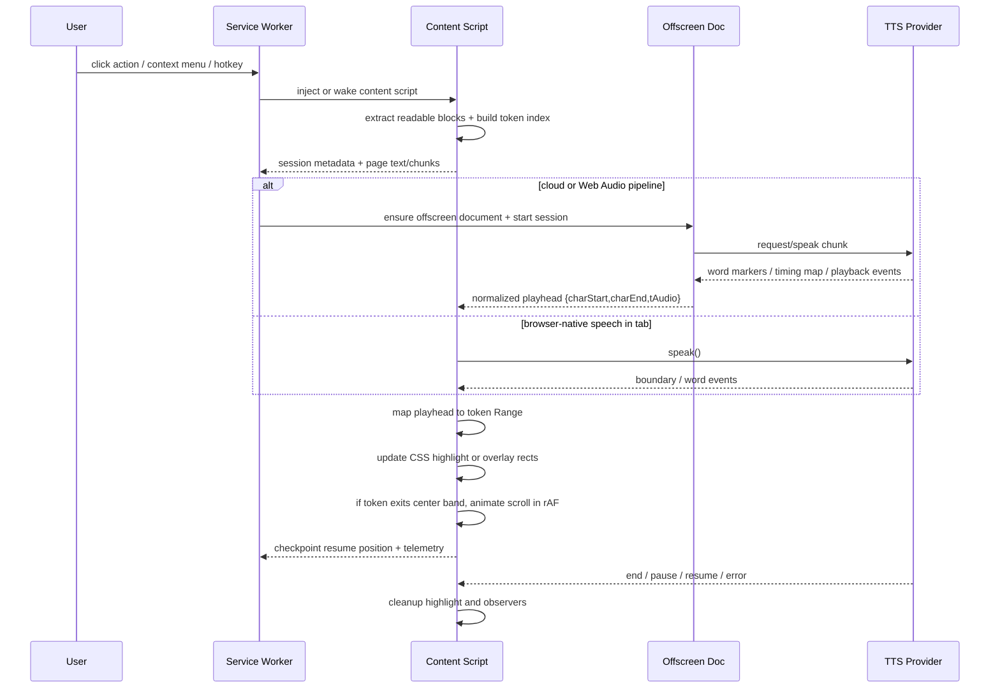

# High-Performance Real-Time TTS Overlays for Chromium Extensions

## Executive summary

The main constraint is brutally simple: the hot path for a read-aloud overlay lives in the same renderer process and main thread as the page you are augmenting. In Manifest V3, the service worker is intentionally ephemeral and has no DOM, so it is the wrong place for a per-word highlighting/render loop. The best default architecture is therefore: **service worker for orchestration and permissions, content script for DOM indexing/highlighting/scrolling, and an offscreen document or other long-lived extension context for any persistent audio pipeline that needs DOM or stable lifetime**. citeturn25view0turn26view1turn17view0turn27view0

For highlighting, **the CSS Custom Highlight API is the best modern Chromium-first primitive** because it styles `Range` objects without changing page DOM structure. That removes most of the wrapper-node churn that causes style recalculation, layout invalidation, and brittle interaction with complex page markup. Your fallback should be either a **single overlay layer positioned from `Range.getClientRects()`** or, if you absolutely must mutate content, **coarse block-level wrappers rather than per-word wrappers**. citeturn28view3turn28view4turn28view0turn28view1turn37view1

For scrolling, the simplest technically-correct solution is `scrollIntoView({ block: "center" })`, but the best user experience for word-by-word tracking is usually **manual centered scrolling with requestAnimationFrame, hysteresis, and cancellation**. In plain English: do not smooth-scroll every single word. Keep the current token within a center band and only recenter when it leaves that band. That avoids scroll queue buildup and reduces jank on long articles with sticky headers or nested scrollers. citeturn29view1turn29view4turn23view4turn31view3

For audio synchronization, there are really three workable modes. **`chrome.tts`** is attractive for extensions because it exposes word/sentence events and voice capability metadata. **Web Speech** is convenient and browser-native, but boundary behavior is more uneven. **Cloud or pre-generated audio with a timing map plus Web Audio clocking** gives the most deterministic sync, especially when you care about sub-word/word accuracy and latency compensation. If “current word centered on screen” is a product requirement rather than a nice-to-have, the third model is the most controllable. citeturn18view2turn18view4turn33view2turn33view0turn33view1turn20view2turn32view0

Using docs from entity["company","Google","technology company"], entity["company","Mozilla","web software company"], and entity["organization","W3C","web standards body"] as the highest-confidence base, my recommendation is: **build the live overlay with direct DOM/range manipulation plus a tiny UI layer, not a heavy app framework; prefer CSS Custom Highlight on Chrome; isolate controls in Shadow DOM; use rAF only for the visual loop; and treat long tasks and long animation frames as hard regressions**. citeturn28view4turn22view7turn23view0turn23view1turn23view5turn31view2

## Assumptions

This report assumes a **desktop** Chromium/Chrome target, **Manifest V3 only**, and content that is mostly conventional HTML articles, docs, blog posts, or textbook-style pages. It does **not** assume first-class support for PDFs, canvas/WebGL apps, rich editors such as cloud office suites, or app surfaces that virtualize text aggressively. Those cases usually need a different extraction and synchronization strategy. The recommended implementation also assumes a reasonably modern Chrome baseline; if you need to support materially older versions, the offscreen-document and API-support details should be revalidated against your minimum version. citeturn26view1turn17view0turn35view4

I am also assuming that “lightweight overlay” means the extension injects a **small control surface and a moving read-along indication**, not a full-screen reader app with its own virtualized text view. If you instead own the entire reading surface, several constraints ease up because you can control the DOM, scroll container, and compositor layering more directly. citeturn23view0turn23view1turn28view4

## Chromium extension constraints

Chromium’s process model is central to performance. Chromium uses multiple OS processes for stability, security, and responsiveness, and site isolation can move frames into different renderer processes. That helps browser safety and parallelism, but it also means extension behavior has to respect a page/frame/process boundary that is more complex than “one tab, one thread.” In practice, if your extension touches many frames or embedded documents, frame-aware indexing and messaging matter. citeturn27view0turn27view2

Content scripts run in an isolated world, but they still execute in the **same renderer process** as the page’s DOM. That is the single most important performance and security fact for this problem. It means every highlight update, scroll calculation, layout read, or style write competes with the page’s own work. It also means content scripts should be treated as less trusted than the extension backend: messages from them must be validated, and sensitive data or powerful cross-origin actions should not be delegated freely to them. citeturn25view0turn27view1

Manifest V3 moved long-lived background pages to service workers. That improves overall platform performance and security, but it changes extension design: the service worker has **no DOM**, runs only when needed, and Chrome terminates it after short idle windows and long-running event limits. Chrome’s lifecycle documentation says a service worker can be terminated after about 30 seconds of inactivity, if a single request takes longer than 5 minutes, or if a `fetch()` response takes more than 30 seconds. Persistent state must therefore be externalized; globals are not a reliable session store. citeturn17view0turn26view0turn26view1

Chrome’s offscreen documents exist precisely to bridge part of this gap. An offscreen document is a hidden extension page with DOM access, meant for cases where the service worker cannot do the job. Chrome documents that only `chrome.runtime` is available there, and for the `AUDIO_PLAYBACK` reason the document is closed after 30 seconds without audio. For a TTS extension, that makes the offscreen document a strong fit for long-lived playback coordination or cloud-audio pipelines, while the service worker stays small and event-driven. citeturn17view0

The architectural implication is straightforward: **do not put the playback-critical or visual-critical loop in the service worker**. Use the service worker to bootstrap, persist settings, request permissions, inject scripts, and manage session lifecycle. Put DOM indexing and viewport control in the content script. Put any persistent audio session that needs more lifetime or DOM capability in an offscreen document or another user-visible extension page such as a side panel. citeturn26view1turn17view0turn25view6

## DOM, rendering, and highlighting strategies

### DOM mutation strategy

For this product shape, the hot path is tiny: **one moving playhead, one current range, maybe one sentence range, and occasional scroll correction**. That means a full virtual DOM over the page text is usually a tax, not a benefit. The page DOM already exists; your extension should index it, not re-own it. Use framework state only for the overlay controls. For the text itself, direct `Range` manipulation is both cheaper and conceptually cleaner. citeturn28view0turn28view1turn34view1turn34view0

A robust pattern is to tokenize text into **block-local word indices**: paragraph or heading blocks first, word tokens second. Each token stores `{blockId, startNode, startOffset, endNode, endOffset, charStart, charEnd}`. Then a TTS event only does a binary search by character index and updates one reusable `Range`. This avoids repeated DOM walks during playback. When the page mutates, use `MutationObserver` to mark only affected blocks dirty and rebuild those blocks, not the full document. The `MutationObserver` API exists specifically because legacy mutation events were removed as less performant and more error-prone. citeturn22view5turn28view1turn16view5turn36view0

If you need an isolated control surface, mount it in a shadow root. Shadow DOM gives you style/markup encapsulation for your overlay controls without forcing the page text itself into a synthetic tree. That is the right split: **Shadow DOM for the controls, native page DOM for the readable text**. citeturn22view7

### Rendering and painting

The rendering rulebook is still the boring one, and boring wins: animate or move things with **`transform` and `opacity`**, not with layout-affecting properties like `top` and `left`, unless you have profiled a real need. Web.dev’s rendering guidance is explicit that compositor-only properties avoid layout and often paint, while other properties can make smooth animation much harder. citeturn23view0turn23view1

For extension-owned UI, apply containment strategically. The CSS `contain` property lets you tell the browser that layout, paint, style, or size calculations can be bounded within a subtree. On a small fixed/sticky control bar or overlay widget, `contain: layout paint style;` is often a net win because it reduces the blast radius of updates. On the other hand, `contain` is not magic and can change layout behavior, so use it only on extension-owned subtrees, not arbitrary page content. citeturn22view6

Use `will-change` as a scalpel, not a religion. Chrome and web.dev both warn that layer promotion is useful for moving elements, but it consumes memory and management overhead. For an overlay caret, an animated spotlight, or a sliding control bubble, it can be appropriate to enable `will-change: transform` only while active and remove it when idle. citeturn23view0turn23view1turn22view17

Batch layout reads and writes. A simple operational discipline is enough: in one tick, read geometry first (`getBoundingClientRect`, `Range.getClientRects`), then schedule all DOM writes and scrolling into the next rAF. This prevents accidental layout thrash. Chrome’s performance docs and MDN’s range geometry APIs support this model directly. citeturn23view4turn28view0turn28view1

### Highlighting options

For a Chromium-first extension, the strongest current choice is the **CSS Custom Highlight API**. MDN documents that it styles arbitrary `Range` objects **without affecting the underlying DOM structure**, and recent web.dev compatibility notes show Chrome support from version 105. That is almost tailor-made for moving current-word highlights in an extension. citeturn28view3turn28view4turn36view0turn36view1

If you cannot rely on custom highlights, the next best fallback is usually **a single overlay layer** driven from `Range.getClientRects()`. Instead of wrapping text, you compute the token’s geometry and draw a background capsule, underline, or spotlight element in a fixed/absolute extension layer. That preserves page DOM and still gives you pixel-level control. The tradeoff is complexity on bidirectional text, fragmented inline boxes, and line-wrap changes. citeturn28view0turn28view1

Direct DOM wrappers using `Range.surroundContents()` or a library such as `mark.js` work, but they are meaningfully worse for per-word motion. `Range.surroundContents()` literally moves content into a new node, and `mark.js` works by wrapping matches with elements such as `<mark>`. That is fine for search hits or paragraph-level emphasis, but for a word that changes dozens or hundreds of times during playback, DOM mutation becomes the bottleneck and the fragility source. citeturn28view1turn37view1turn37view0

Pure CSS by itself is not enough here. Even with `::highlight()`, JavaScript still has to decide which range is current. So the right comparison is not “CSS versus JS,” but **“DOM-neutral JS-managed ranges versus DOM-mutating JS wrappers.”** On Chrome, the former wins almost every time for read-along overlays. citeturn28view4turn28view3

## Auto-scrolling and TTS synchronization

### Smooth centered scrolling

The DOM API answer is `scrollIntoView({ behavior: "smooth", block: "center", inline: "nearest" })`. MDN documents `block: "center"` explicitly, and for many pages it is good enough. It is the right first implementation because it is short, readable, and reasonably robust. citeturn29view1turn29view2turn29view4

The product answer is usually stricter. If you call smooth `scrollIntoView()` at every word boundary, you can easily queue overlapping scroll animations and fight the page’s own scroll logic, sticky toolbars, or anchor adjustments. A better production pattern is: identify the real scroll container; define a center band such as 35%–65% of its visible height; do nothing while the current token stays inside the band; and only when the token leaves the band, animate `scrollTop` manually in rAF toward a centered target. This is an engineering inference, but it is directly motivated by the frame-budget and compositor guidance in Chrome’s rendering docs. citeturn23view0turn23view4turn31view2turn31view3

`scroll-margin-top` and `scroll-margin-bottom` are useful when you intentionally use `scrollIntoView()` on pages with sticky headers, because the browser will otherwise align against the raw container edge. MDN calls this out specifically. In a manual-centering implementation, you usually compute the corrected target yourself instead. citeturn29view0turn29view1

Scroll anchoring can also fight you. The `overflow-anchor` property exists so that browsers can preserve the user’s viewport position when content changes, but on a reader overlay that is intentionally driving the viewport, anchoring can become a tug-of-war. Disable or neutralize it only on the extension-owned scroll surface when you own the scroller; avoid spraying it across arbitrary page DOM. citeturn5search4

### TTS and timing models

If you use the Web Speech API, `SpeechSynthesisUtterance` exposes `boundary`, `start`, `end`, `pause`, `resume`, and `mark` events. MDN documents `charIndex` and `elapsedTime` on `SpeechSynthesisEvent`, which is enough to map speech progress back to a word index in your token table. The catch is that boundary support is not as uniform or deterministic as a custom timing map, and implementation quality varies by voice engine. citeturn33view2turn33view0turn33view1turn33view3

If you use the extension `chrome.tts` API, Chrome exposes richer extension-specific events. The API can fire `word`, `sentence`, `marker`, `start`, `end`, `interrupted`, `cancelled`, `error`, `pause`, and `resume` events, and `getVoices()` can indicate which event types a voice supports. Chrome’s docs also note that a `word` event fires at the end of one word and before the next, with `charIndex` and `length` pointing at the next unit. That is better suited to extension work than naïve timers, but it still requires a provider-normalization layer because different engines and voices expose different event fidelity. citeturn18view2turn18view4

For highest-fidelity sync, especially with cloud or premium voices, use **timed audio plus an explicit timing map**. The Web Audio model gives you the audio hardware clock via `AudioContext.currentTime`, plus latency-related properties such as `baseLatency` and `outputLatency`. The classic Chrome audio scheduling guidance still holds: schedule audio against the audio clock, and drive visuals with rAF while consulting the audio clock, not `setTimeout()` as your source of truth. citeturn20view2turn20view11turn32view0

That yields a simple rule: **audio is authoritative, visuals chase it**. Whether your provider is `chrome.tts`, `speechSynthesis`, or cloud audio, normalize everything to a provider-independent playhead event like `{ charStart, charEnd, tAudio }`. Then the content script can update exactly one current highlight and maybe one scroll animation. That separation is what keeps the system understandable at 2 a.m. when the page is hostile and the voice callbacks are weird. citeturn18view2turn33view0turn32view0

## Candidate frameworks and libraries

The practical question for this product is not “what framework is fashionable,” but “what can I inject into someone else’s renderer without becoming the loudest object in the room.” The table below focuses on **runtime footprint and hot-path cost** for extension overlays.

| Option | Approx runtime size | Runtime cost profile | Best use in this product | Main downside |
|---|---:|---|---|---|
| Vanilla DOM + platform APIs | ~0 KB framework runtime | Lowest parse/execute overhead; you control every layout read/write | **Best default** for highlighting, scrolling, token indexing, and a tiny UI | More boilerplate; team discipline matters |
| Lit | ~5 KB minified/compressed | Fine-grained template updates without full VDOM diff | Excellent for overlay controls or side panel UI, while keeping text handling native | Still a runtime abstraction; not needed for the text hot path |
| Preact | ~3 KB by project claim | Small VDOM with batched updates and good ergonomics | Good if your team is React-shaped but wants a much smaller overlay runtime | VDOM still adds indirection for a problem that is mostly one moving range |
| Solid | community tools commonly report ~8 KB-class gzip footprint | Fine-grained reactivity, no VDOM diff | Good if you want reactive programming without React-style reconciliation | Slightly more niche team familiarity; still overkill for bare-metal range work |
| Svelte | app-specific compiled output; no large framework-style VDOM runtime | Compiler moves work to build time; generated DOM ops can be lean | Good for a richer control surface if you accept a compile-time framework | Build pipeline complexity; less compelling if UI is tiny |
| mark.js | cdnjs lists ~2 KB | Async DOM-wrapping matcher; useful for search-like highlights | Okay for coarse search/sentence emphasis or non-hot-path highlights | **Not ideal for moving current-word highlights** because it mutates DOM structure |

The size and behavior claims above come from the official Preact and Lit docs, Svelte’s official overview, and size references from cdnjs / package analysis pages where the projects themselves do not publish a single canonical compressed runtime number. citeturn34view0turn34view1turn34view5turn34view4turn37view0turn37view1

**Recommendation:** for the injected page overlay, use **vanilla DOM + `Range` + CSS Custom Highlight API**. If you want a nicer control surface, add **Lit** or **Preact** only for the extension-owned controls. Do **not** let any framework reconcile the document text itself. That is where page compatibility and frame budget go to die. citeturn28view4turn34view1turn34view0turn23view0

## Recommended architecture

The recommended architecture is a **three-context split**:

- **Service worker**: user gesture entry points, permissions, script injection, storage, resume state, session bootstrap.
- **Content script**: text extraction/token indexing, highlight application, scroll-container detection, Resize/Mutation observation, and the real-time visual loop.
- **Offscreen document or another long-lived extension page**: optional but recommended for persistent cloud-audio/Web Audio playback, timestamp normalization, and any DOM-dependent background functionality. citeturn26view1turn17view0turn25view6

This split matches MV3’s capabilities and avoids trying to force a long-lived media session into an object that Chrome is designed to suspend. It also respects the security model by keeping cross-origin and sensitive backend logic outside the page renderer whenever possible. citeturn17view0turn25view0turn25view5

### Sequence diagram



The important design trick is the **normalized playhead contract** between providers and the content script. The content script should not care whether the event came from `chrome.tts`, Web Speech, or a cloud timing map; it should only consume a provider-neutral playhead and repaint the minimum necessary state. citeturn18view2turn33view0turn33view1turn32view0

### Code-pattern snippet for highlight + centered scroll

This pattern uses a reusable `Range`, CSS Custom Highlight when available, and a manual scroll-centered fallback with hysteresis. It is intentionally framework-free because this is the actual hot path.

```ts
type Token = {
  id: number;
  charStart: number;
  charEnd: number;
  startNode: Text;
  startOffset: number;
  endNode: Text;
  endOffset: number;
};

const currentRange = new Range();
let currentTokenId = -1;
let scrollRaf = 0;

function applyToken(token: Token, scroller: Element | Document) {
  if (token.id === currentTokenId) return;
  currentTokenId = token.id;

  // Reuse one Range object.
  currentRange.setStart(token.startNode, token.startOffset);
  currentRange.setEnd(token.endNode, token.endOffset);

  // Primary path: CSS Custom Highlight API.
  if ("highlights" in CSS) {
    const highlight = new Highlight(currentRange);
    CSS.highlights.set("tts-current-word", highlight);
  } else {
    // Fallback: draw one overlay element from getClientRects().
    drawOverlayRects(currentRange.getClientRects());
  }

  maybeCenterCurrentWord(currentRange, scroller);
}

function maybeCenterCurrentWord(range: Range, scroller: Element | Document) {
  const rect = range.getBoundingClientRect();
  const viewport = getScrollerViewport(scroller);

  const upperBand = viewport.top + viewport.height * 0.35;
  const lowerBand = viewport.top + viewport.height * 0.65;
  const tokenMidY = rect.top + rect.height / 2;

  // Hysteresis: do nothing if already near center.
  if (tokenMidY >= upperBand && tokenMidY <= lowerBand) return;

  const targetScrollTop = computeCenteredScrollTop(rect, viewport, scroller);

  cancelAnimationFrame(scrollRaf);
  const start = getScrollTop(scroller);
  const delta = targetScrollTop - start;
  const startedAt = performance.now();
  const duration = 180;

  scrollRaf = requestAnimationFrame(function tick(now) {
    const t = Math.min(1, (now - startedAt) / duration);
    const eased = 1 - Math.pow(1 - t, 3); // ease-out
    setScrollTop(scroller, start + delta * eased);
    if (t < 1) scrollRaf = requestAnimationFrame(tick);
  });
}
```

This pattern relies on APIs explicitly documented by MDN: `Range.getBoundingClientRect()`, `Range.getClientRects()`, and `::highlight()`/the Custom Highlight API for DOM-neutral highlighting. The center-band logic is the implementation judgment call that turns a technically-correct solution into one that doesn’t seasick the user. citeturn28view0turn28view1turn28view4turn29view1

### Code-pattern snippet for provider normalization

The point of this adapter is to make every provider emit the same shape.

```ts
type Playhead = {
  charStart: number;
  charEnd: number;
  tAudioSeconds?: number;
};

function fromChromeTtsWordEvent(ev: { charIndex: number; length?: number }): Playhead {
  // chrome.tts word events point at the next unit; length is useful when present.
  return {
    charStart: ev.charIndex,
    charEnd: ev.charIndex + Math.max(ev.length ?? 1, 1),
  };
}

function fromSpeechBoundaryEvent(ev: SpeechSynthesisEvent, nextBoundary: number): Playhead {
  return {
    charStart: ev.charIndex,
    charEnd: nextBoundary,
    tAudioSeconds: ev.elapsedTime,
  };
}

function onPlayhead(playhead: Playhead) {
  const token = tokenIndex.findFirstIntersecting(playhead.charStart, playhead.charEnd);
  if (token) applyToken(token, activeScroller);
}
```

The provider adapter layer is where you compensate for engine weirdness, expose a user-tunable sync offset, and swap between browser-native and cloud-backed voices without rewriting the visual subsystem. citeturn18view2turn33view0turn33view1turn32view0

## Profiling, security, OSS patterns, checklist, and open questions

### Profiling and metrics

Use **Chrome DevTools Performance panel** to capture live playback and identify scripting, layout, paint, and compositing costs. Use **Performance Monitor** during manual testing because it surfaces real-time CPU usage, JS heap size, DOM node count, event listener count, frames, layouts/sec, and style recalcs/sec. For memory investigations, Chrome’s memory troubleshooting guide recommends using the Performance panel with the Memory checkbox and forcing garbage collection at the start and end of recordings. citeturn23view7turn23view6turn23view8

At runtime, instrument **Long Tasks** and **Long Animation Frames** with `PerformanceObserver`. The Long Tasks API flags UI-thread work of 50 ms or more; MDN’s LoAF docs explain why that still misses some janky frames and why the long-animation-frame entry type is more informative for visual regressions. For a read-aloud overlay, both are useful: long tasks catch obvious blocking work, while LoAFs catch the “death by many small cuts inside one frame” problem. citeturn30view0turn31view0turn31view2turn31view3turn23view5

My recommended engineering budgets are these:

- **Steady-state playback:** zero long tasks over 50 ms and zero long animation frames over 50 ms in normal reading flows. citeturn30view0turn31view2
- **Frame budget:** design highlight and scroll updates to stay well under the ~16 ms frame time needed for smooth 60 fps animation; in practice, aim for **p95 under 4 ms** for the extension’s own per-word update work, because the page still needs the rest of the frame. This 4 ms target is an implementation recommendation derived from Chrome’s 60 fps guidance, not a browser requirement. citeturn23view2turn31view2
- **DOM churn:** steady-state highlighting should add **zero** wrapper nodes on the primary path and mutate at most one current-word visual state plus one scroll animation object. That recommendation follows directly from the DOM-neutral Custom Highlight and range-geometry approach. citeturn28view3turn28view4
- **Bundle budget:** aim for an injected overlay core of **≤15 KB gzipped**, with a hard ceiling around **30 KB** for the content-script runtime. This is a recommended budget, not a standards threshold; it follows from the small-runtime options available and the fact that injected code parses/executed in the page renderer. citeturn34view0turn34view1turn34view5

### Security and permissions tradeoffs

Prefer **`activeTab` + `scripting`** when playback starts from an explicit user action on the current tab. Chrome documents that `activeTab` grants temporary access to the current tab only after user invocation and avoids an install-time warning that broad host permissions can trigger. That is the cleanest permission posture for a “click-to-read” overlay. citeturn25view3turn25view6turn25view2

Request persistent `host_permissions` only if your product truly needs always-on behavior across sites or direct cross-origin communication. Chrome’s network-permission docs are very clear that cross-origin requests belong in extension contexts with host permissions, and content scripts are subject to the page’s CORS rules even when the extension has broader host access. citeturn25view5turn27view1

Treat content scripts as semi-trusted. Chrome’s security guidance explicitly says content scripts interact directly with hostile pages, run in the same renderer process, and should not receive secrets or broad arbitrary powers. Validate every message coming from the page-facing side, sanitize any user/page-derived input, and keep privileged API calls narrow and explicit. citeturn25view0

Do not fight MV3’s security model. Remote hosted code, `eval`, and arbitrary string execution are removed or restricted for MV3 extensions. Bundle your code, build resource URLs with `chrome.runtime.getURL()`, and keep third-party runtime dependencies under control. citeturn26view2turn26view0

### OSS patterns worth emulating

From entity["company","GitHub","developer platform company"], the most useful open implementations and patterns I found are:

- **`ken107/read-aloud`**: a mature browser extension with multi-provider TTS, highlighting, and a broad site-compatibility surface. It is a good reference for feature breadth and cross-site pragmatism. citeturn35view0
- **`justinIs/read`**: a smaller, cleaner example with separate `background`, `content`, `popup`, and `settings` folders. It is useful as a reference for MV3-ish separation of concerns in a simpler codebase. citeturn35view1
- **`westonruter/spoken-word`**: not a Chromium extension, but very relevant for product behavior. It uses browser speech synthesis, read-along highlighting, sticky controls, paragraph-aware skipping, and persistent scrolling to keep the current text in view. That is extremely close to the UX pattern you want. citeturn35view2
- **`aedrax/ElevenPage-Reader`**: useful as a modern example of cloud-TTS integration with sentence-level and word-level highlighting plus playback controls. citeturn35view3
- **Chrome’s official extension samples**: best for API usage patterns, offscreen docs, scripting injection, and storage/runtime structure. citeturn35view4

I would emulate the **behavioral patterns** from those repos more than the exact implementation details. None of them should be treated as a security audit or a performance gold standard by default. citeturn35view0turn35view1turn35view2turn35view3

### Best-practices checklist

- Keep the service worker skinny: bootstrap, persist, permission-gate, inject, exit. Do not make it your playback brain. citeturn17view0turn26view1
- Build a **token index once per block**, not per word event. Patch dirty blocks with `MutationObserver`. citeturn16view5turn28view1
- Use **CSS Custom Highlight API first** on Chrome; fall back to `Range.getClientRects()` overlay drawing; use DOM wrappers only as a last resort. citeturn28view4turn28view3turn28view1
- Isolate extension controls in **Shadow DOM** and optionally set `contain` on extension-owned UI subtrees. citeturn22view7turn22view6
- Prefer `transform`/`opacity` for any moving extension-owned visuals; remove `will-change` when idle. citeturn23view0turn23view1turn22view17
- Use `requestAnimationFrame` for the **visual loop**, but use the **audio clock or provider event timestamps** as the synchronization source of truth. citeturn32view0turn33view0turn20view2
- Recenter with a **center band and cancellable manual scroll**, not a smooth-scroll command on every word. citeturn29view1turn23view4turn31view3
- Monitor **CPU, heap, DOM nodes, layouts/sec, style recalcs/sec**, and add `PerformanceObserver` probes for `longtask` and `long-animation-frame`. citeturn23view6turn30view0turn31view0
- Prefer **`activeTab`** unless you really need persistent host access. Route cross-origin fetches through extension contexts, not content scripts. citeturn25view3turn25view5turn27view1
- Bundle all code locally; no remote code tricks, no `eval`, no string execution hacks. citeturn26view2turn26view0

### Key sources

These are the highest-value source families for this topic:

- Chrome Extensions MV3 and migration docs from entity["company","Google","technology company"]: MV3 overview, service worker migration, offscreen documents, permissions, `activeTab`, scripting, security. citeturn26view0turn26view1turn17view0turn25view1turn25view2turn25view3turn25view6turn25view0
- Chromium process and isolation docs: process model, site isolation, OOPIF. citeturn27view0turn27view2
- Web platform API documentation from entity["company","Mozilla","web software company"]: `Range`, Custom Highlight, Shadow DOM, `scrollIntoView`, `SpeechSynthesis*`, Long Tasks, Long Animation Frames, latency APIs. citeturn28view0turn28view4turn22view7turn29view1turn33view2turn30view0turn31view2turn20view2
- Web performance guidance from web.dev: compositor-only animation, frame budget, long-task optimization, audio scheduling. citeturn23view0turn23view1turn23view4turn32view0
- Standards documents from entity["organization","W3C","web standards body"]: Long Tasks API and the Web Speech / Web Audio specifications linked from MDN. citeturn23view5turn33view0turn33view1turn20view2
- OSS references from entity["company","GitHub","developer platform company"]: `read-aloud`, `read`, `spoken-word`, `ElevenPage-Reader`, and Chrome extension samples. citeturn35view0turn35view1turn35view2turn35view3turn35view4

### Open questions and limitations

A few things were unspecified and materially affect implementation choice:

- **Target pages:** PDF viewer, canvas/text-rendered apps, and large editors need special handling and may make range-based token mapping impractical.
- **Provider choice:** browser TTS versus cloud TTS is not an implementation detail; it determines your synchronization model.
- **Always-on versus user-invoked reading:** this determines whether `activeTab` is enough or whether persistent host permissions are justified.
- **Minimum Chrome version:** if you need broad legacy support, re-check offscreen-document APIs and any newer DOM options against that floor. citeturn26view1turn17view0turn35view4

If your real target includes **Google Docs-like editors, PDF reading, cross-origin iframe-heavy sites, or premium cloud voices with phoneme-accurate word timing**, the architecture above still broadly holds, but the extraction, timeline normalization, and fallback paths need a more specialized design. citeturn27view2turn35view3turn35view4